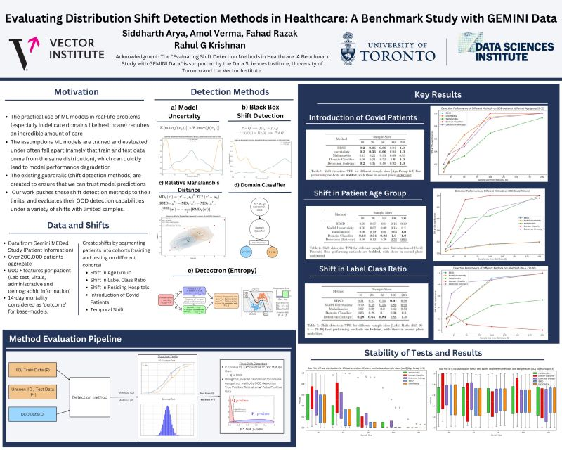

Date: "May 2023 - August 2023"

Company: Data Science Institute.

- **Developed a Novel ML-Based Monitoring System**: Engineered a method to monitor and evaluate deployed deep neural networks, achieving a 93% True Positive Rate in predicting model failure. This proactive approach ensured reliability and performance, in collaboration with peers at the Vector Institute of Technology.  
- **Data Processing and Predictive Modeling**: Organized and cleaned data for over 200,000 patients into 900 features (lab results, vitals, demographics) using SQL and NumPy. Trained neural networks to predict 14-day mortality with ~95% accuracy.  
- **Benchmarking Shift Detection Methods**: Led a study evaluating shift detection techniques on real-world medical and semi-synthetic data. Implemented solutions using PyTorch and Scikit-learn, supported by a research grant from the Data Science Institute at the University of Toronto.  
- **Showcase Day Presentation**: Presented findings to highlight the importance of reliable AI in healthcare, alongside a cohort of grant recipients.  

